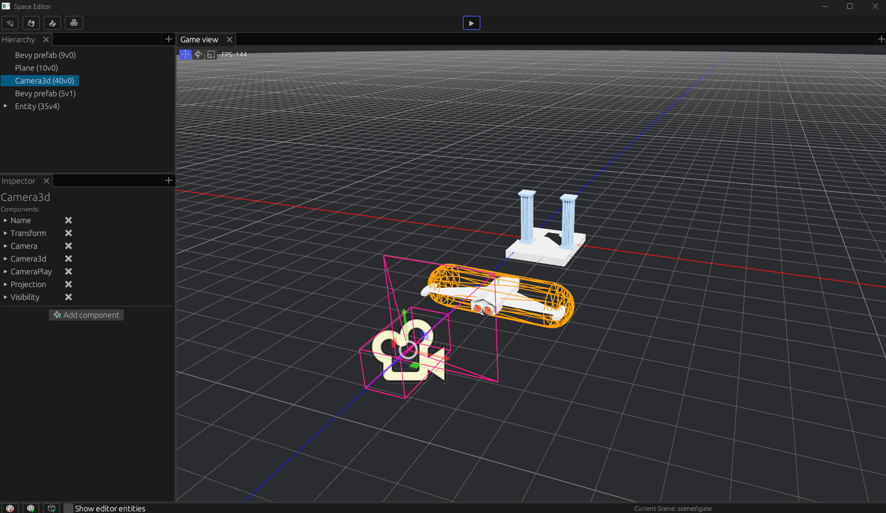
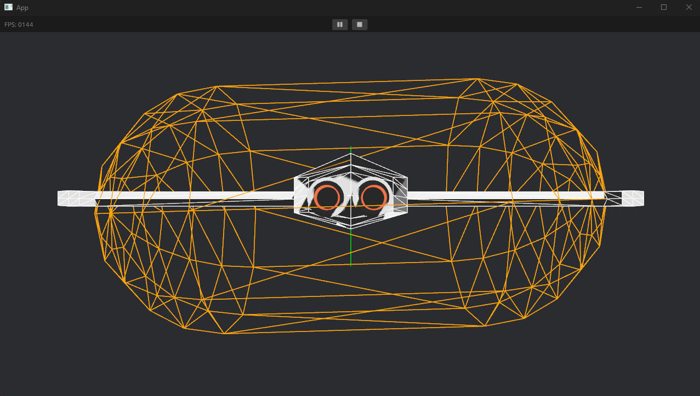
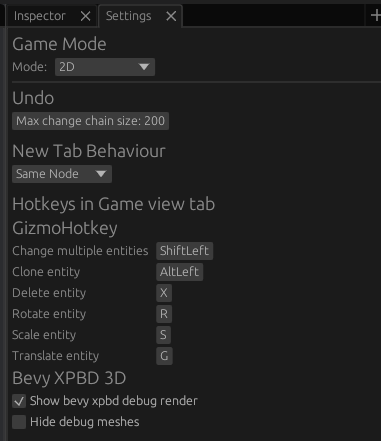

# space_editor: The Bevy Prefab Editor
License: MIT [](https://codecov.io/gh//rewin123/space_editor)

### Editor in Edit Mode


### Editor in Play Mode


space_editor is useful tool for scene/prefab/prototyping with bevy engine.  Its allow to create/modify levels/scenes/prefabs in fast gui based way.

## Project goal

Aspires to be editor for bevy while there is no official editor.

## Core Team

* Project Lead:         rewin <rewin1996@gmail.com>
* Developer Experience: Julia Naomi <jnboeira@outlook.com>
* UX Designer:          Jay Kim <jaykim9419@gmail.com>

## Main features

- **Intuitive Scene and Prefab Management**: Space Editor allows you to prepare and save scenes and prefabs with an intuitive user interface. You can easily reuse them in your game development workflow. 
- **bevy_xpbd_3d compatibility**: Space Editor supports bevy_xpbd_3d, including all editor features. (bevy_xpbd_2d not supported)
- **Gizmo-Based manipulations**: Manipulate entity positions, rotations, and scales using gizmos. 
- **Component values editing**: Easily edit component parameters within the editor UI 
- **Seamless Editor-Game switching**: Switch between the editor UI and the game effortlessly for fast prototyping and testing. 
- **Prefab Reusability**: Prefabs can be nested within other prefabs, improving reusability and organization in your projects. 
- **Many custom components**: Space Editor implements various custom components to seamlessly integrate its saving system with the standard Bevy scene format. 
- **Easy API for customization**: Customize or register your own components within the editor with ease, tailoring it to your specific project needs.
- **Event dispatching**: Send custom events directly from the editor UI for easier gameplay debugging.  
- **API for adding tabs**: Extend the functionality of the editor by easily adding new tabs, enhancing your workflow. 

Getting Started
To run the editor, use the following command:
> cargo run

To run platformer example, use the following command:
> cargo run run --example platformer --features bevy_xpbd_3d

## Usage

Space editor comes with 2 binaries:

1. `space_editor`, the default application, which can be executed with `cargo run -r`. This is the game editor for bevy engine.
2. `game_app`, a simple game that can be used to generate your own game application. This can be executed with `cargo run -r --bin game_app`. All the logic for this is located in folder `game/`.

> Add all your game logic to the game folder `lib.rs`, under `GamePlugin` plugin to have it reflected in **space_editor**.

### Forking strategy

To allow users to get latest updates from `space_editor`, the suggested workflow is:
1. Fork the project.
2. Rename `game_app` to your projects name and configure `space_editor` as you prefer.
3. Create a branch for `space_editor`'s downstream.
4. Regularly sync the changes from your desired `space_editor` branch.
5. Sync your downstream branch with your local main branch.
6. Code your game in `game/` folder.
7. Store your assets in the `assets` folder.

### Upstream to `space_editor`

If you have made some nice new feature, fixed a bug on space editor or any other contribution that you feel might be relevant, all PRs are welcomed!

## Usage - As Game Plugin

The following explains how to integrate `space_editor` as a game plugin to use the created prefabs in your game.

### Cargo

Add this line to your Cargo.toml file
```toml
space_editor = {git = "https://github.com/rewin123/space_editor.git"}
```

### Prefab spawn system
To utilize the prefab spawn system, simply add the plugin to your application as follows:
```rs
App::default()
    .add_plugins(DefaultPlugins)
    .add_plugins(PrefabPlugin)
```

For spawning, use the PrefabBundle:
```rs
 commands.spawn(PrefabBundle::new("cube.scn.ron"))
        .insert(Name::new("Prefab"));
```

(More code at examples/spawn_prefab.rs)

## Customization

**More detailed information in docs/README.md**

Custom types can be added to the editor gui and prefab spawn system with just a single line:

```rs
use editor::prelude::EditorRegistryExt;

app.editor_registry::<Name>();
```

The representation of components in the editor UI can also be customized by bevy_inspector_egui library.

### Events

Custom Events can be added to the editor UI with the following:

```rs
#[derive(Event, Default, Resource, Reflect, Clone)]
#[reflect(Resource)]
pub struct Name;

use editor::prelude::EditorRegistryExt;

app.editor_registry_event::<Name>();
```

One limitation is that events must implement `Event, Default, Resource, Reflect, Clone`, with `Resource` reflected. Once registered, events can be sent using the `Event Dispatcher` tab.

> Obs: editor already handles internally objects registration and initialization:
> 
> `register_type::<T>() and init_resource::<T>()`

> To disable this, use feature `no_event_registration`.

### Prefab
A prefab is simply a Bevy scene serialized to a readable and editable RON format. However, it needs to be spawned through PrefabBundle to activate custom logic such as adding global transforms to an object.

> More documentation can be found at the [docs folder](docs/README.md)

## 2D Mode support

SpaceEditor can handle most 2D bevy elements, such as 2D Camera, 2D meshes and Sprites. 

Game mode can be changed between 3D and 2D in `settings > GameMode`. This changes the editor camera configuration.



## More Documentation on
- [Extended Documentation](docs/README.md)
- [Shortcuts/Hotkeys Configuration](docs/shortcuts.md)

|bevy|space_editor crates|
|---|---|
|0.14| 0.6|
|0.13| 0.5|
|0.12| 0.3 - 0.4|

### Contributing
Any request for adding functionality to the editor is welcome. Open an issue on the [issue tracker](https://github.com/rewin123/space_editor/issues).
Any pull request is welcome too:)

- PR to main: Bug Fixes and Tests
- New features and others: next version branch **(ex: last released is 0.5, so create PRs for branch v0.6)**

### Branch Policy
* **v0.x Branches:** These branches house versions of the editor that are actively being developed. Currently, the primary focus is on branch v0.6.
* **Main Branch:** The main branch exclusively hosts stable versions of the space_editor without any known bugs. Updates to this branch are limited to bug fixes, documentation improvements, or merging in the v0.x branch once all identified issues have been resolved, and the version is considered complete.

### License
MIT - https://choosealicense.com/licenses/mit/

### Project naming

Space_editor started as part of my prototype space game, which I feel could be useful in development, so I thought I'd share my inbuilt editor. Since the game is about space and the name of the editor starts with space_*:) 

