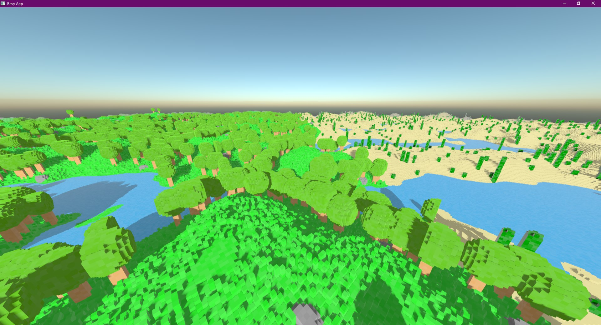
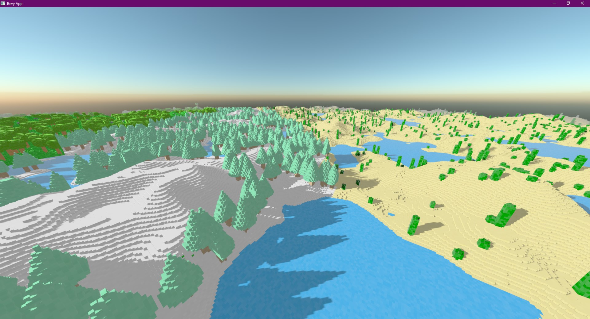
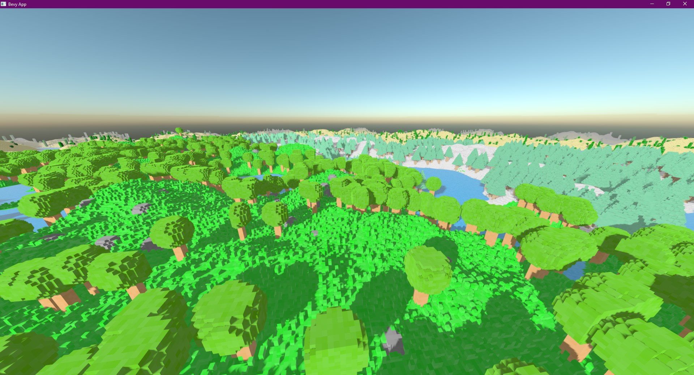

    <h1><code>vx_bevy</code></h1>
        Voxel engine prototype using rust and bevy.
        (Also check out <a href="https://github.com/Game4all/unnamed-voxel-tracer">my raytraced voxel engine</a>)
    

> **Note**
> This respository won't receive further updates to newer bevy versions. Thus current code may require modifications to port to newer bevy versions.

A minecraft-esque voxel engine rendering prototype made using the Bevy game engine.

Chunk are rendered using a triangle mesh per chunk. Chunks are greedily meshed.

Meshing and generation tasks are using bevy's `AsyncComputeTaskPool` to dispatch tasks across frame to prevent frame stuttering.

Performance is okayish (~100fps on a 1060 + 8th gen intel on release mode) with default render distance (16 chunks) altough mesh stitching could allow this to go even higher up.

Also don't go under the world.

## Screenshots

## Acknowledgments

This was ported to bevy 0.10.0 thanks to the efforts of [@naomijub](https://github.com/naomijub) with help from [@hans-pistor](https://github.com/hans-pistor).

Ported to bevy 0.11.3 thanks to [@juliohq](https://github.com/juliohq).

Ported to bevy 0.12.0 thanks to [@rparrett](https://github.com/rparrett).

This uses the awesome [block-mesh](https://github.com/bonsairobo/block-mesh-rs) crate which handles greedy meshing.
